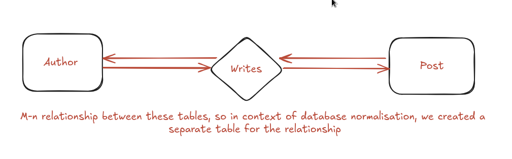

# Sqlite 

- so like the use case of sqlite is where we don't need centralization of data since the database is technically serverless and is present in memory 
- its easy to setup sqlite, just follow docs and install the sqlite database natively in your project, although we can use to build web apps which behave like having a centralized database but that is tricky 
- and sqlite comes default with the python package, we can directly write the queries to the database if we want using the sqlite methods present in its official docs which are different for every language
- or we can use an ORM for every language to help us deal with the database in a more Object Oriented Fashion 
- in general sqlite me we connect to the database first using some variable and then we write some queries on the variable which is connected to the database and then commit the changes that we made to database, and here we can use with keyword more efficiently to manage context more efficiently in order to automatically close the database connection that we created to commit the changes   

# Sqlalchemy and flask_sqlalchemy 

- if there are already created tables in databases then create classes of those tables kyuki orm is an object oriented interface to access the database 
- unhi classes ke objects are the tuples of the tables of the database

- so there's a native sql_Alchemy version for flask too which we'll be using in this project, and we could've used other libraries too like the main sqlalchemy library itself but yea we just want to get the job done as fast as possible so yea 
- and if we're installing the flask-sqlalchemy package then the core of the sqlalchemy package is also installed with it which is necessary for the flask-sqlalchemy

# Flask_sqlalchemy installation and basic syntax
- pip install flask-sqlalchemy
- and then we set the environment variable of SQLALCHEMY_DATABASE_URI to string 'sqlite:///name_of_the_database.db'
- this is common across all sqlite that the name of the sqlite database is usually started with triple /
- then we create an instance of the sqlite database inside the file itself and like since the package is of flask-sqlalchemy therefore we pass the app instance that we created earlier using the Flask() class
- we definitely have some updates in the syntax of the flask-sqlalchemy library where the column is replaced by the mapped_column(), and now we're declaring the type of the variable at the start itself only to introduce type safety where like the Columns can't take values other than the dataType declared to them
- and sirf type safety wgera change hua hai and like we don't need to worry about the values which used to get passed in the attributes
- String datatype is given to those attributes where we're concerned about the storage of the data inside the attributes and where we can control the limit to the fields and the Text dataType is given to fields where like limit is unknown ki kitna content aayega 
- Columns are the attributes of the rows in the table but relationships is a join of the current table with some other table present in the database
- and like this join (of "natural" nature) retrieves the tuples/rows from the other table with equal foreign key attributes 
- this relationship field accepts a backref property which creates a similar relationship in the table which is connected to the current table with the name of the string passed in the backref property of the relationship field 
- and there is another property names lazy which when set to True only adds these tuples which has same value of the foreign key to the object instance of the User class when the programmer retrieves the data using the syntax :- object_instance.posts
- and same goes with the author relationship created in the other Table like object_instance of the other class will also only retrieve the tuples with the same ids when it is mentioned
- there is one default property of every field I guess where we can pass the default value of some Column Attribute so like when the user doesn't passes any value in the field and if still the value is not-nullable so like the orm automatically give it that default value 
- we also gotta pass foreign key in one of the models which are related and have attributes which retrieve data from the other table 
- the mentioning of user.id in foreign key property of any field signifies that the user.id means that we're referencing some table named "user" instead of the class, and ye thoda ORM ke nature ke wajah se aisa hai ki ek jagah relationship banaate wakt they want capital letter and table mention karte wakt they want small letter

- __tablename__ attribute of the table flask of sql alchemy helps us to name the table so that we can use that name in future for referencing foreign keys and stuff

# Magic methods in python classess and some other packages inside python

- these special classes are specific to python only and like we can design the behaviour of the objects of the class instance using these methods like we can even define addition and subtraction of 2 custom objects that we create using these methods
- one of these methods is __repr__ which us to decide the string representation of the objects created which is exactly what printed when we use the print function on these Objects 
- for declaring variables with datetime datatype we gotta import datetime method from the datetime package itself and like it is included with the python package only we just gotta import the package now 
- so like the datetime package has an attribute which specifies the current time and the timezone too 

# Database creation and updates to the database using flask-SQLAlchemy

- so in order to create database we use create_all() method from the db instance that we created earlier
- but in order to access these methods we gotta provide the application context which gives the access to these methods when we run it in the terminal 
- basically in simple terms db methods ko app context dena padega to operate
- usi same app_context me import the classes, and just like we create objects of certain classes, we'll create rows using the class
- create karne ke baad db.session.add() and then to commit changes to the database db.session.commit()
- ye session object jo hota hai na vo important hai for batching all the updates in the buffer and it only executes the operations once we commit the changes
- and it also manages to connect the database and deconnect when required and in this way the session object does other optimizations to make sure we get object oriented interface to interact with the database
- there is some rollback object too in the sqlalchemy to manage transactions and errors 
- we can do that using db.session.rollback()
- specific class_name.query.all() to get all the rows of that table with schema present in the class
- this .query after the class name says ki we're writing code which will be converted into sql query, and uss sql query ko complete karne ke liye we add the predicate clause present in the where part of the sql query and we pass filter_by() me ki iss attribute ka ye value hona chahiye
- we can even store the output of these queries in an array and then individual members ke attributes ko access karne ke liye . notation ka use karna makes sense
- user.query.get(any_primary_value) se we get the tuple with the primary_key_value equal to the number passed in the get method  

# Creating one to one relationships in sqlalchemy

Parent Class (): 
    __tablename__ = "parent_table"
    
    parent_id: Mapped[int] = mapped_column(primary_key=true)
    child_id: Mapped[int] = mapped_column(foreign_key="child_table.child_id")
    child: Mapped[List('Parent')] = relationship(back_pupolates="parent")

Child Class ():
    __tablename__ = "child_table"leati

    child_id: Mapped[int] = mapped_column(foreign_key=true)
    parent: Mapped['Child'] = relationship(back_populates="child")

- all in all ek foreign key ho, then 2 relationship banao dono relationship se pura dusre table ka tuple extract hota hai and usme back_populates ka value laga do

# Secondary property of the relationship method in sqlalchemy for connecting relations with no foreign key

- creating intermediate tables for relating 2 tables 
    for example :- 
        Author, Book Table share a relationship in the ER-diagram but they don't have a common foreign key between them

    and let's say the ER diagram is something like this (many to many relationship)
        

    - then in this case we would want that relationship of Author Table should retreive tuple from the Post Table but they don't share foreign key, so we'll directly write something like this

            Class Author():
                __tablename__ = 'author'

                author_id: Mapped[int] = mapped_column(primary_key=true)

                author_name: Mapped(str) = mapped_column()

                posts: Mapped(List('Post')) = relationship(back_populates='authors', secondary="writes")
            
            Class Writes():
                __tablename__ = 'writes'

                author_id: Mapped(int) = mapped_column(ForeignKey('author.author_id'))

                post_id: Mapped(int) = mapped_column(ForeignKey(post.post_id))

            Class Post():
                __tablename__ = 'post'

                post_id: Mapped(int) = mapped_column(primary_key=true)

                post_content: Mapped(str) = mapped_column(db.Text)

                authors: Mapped[List('Author')] = relationship(back_populates='posts', secondary='writes')

# sqlite viewer

- so there are keyword in the sqlite veiwer which helps us to visualize the database 
- keywords like exact mean that the data inside the attribute is case sensetive and also unique 
- we can even pin certain columns in the table which is pretty cool tbh

# Circular imports

- when we shift the database classes in some other file called models.py, then when the python intrepreter reaches the models.py import jisme there is db instance lekin code interpreter db variable ke line tak interpreter pohucha hi nahi
- and jab apan db variable ka neeche import kr dete hai aur models.py me import me filename ko __main__ kar dete hai tab bhi issue terminal me ya fir database writing me solve nahi hoti 
- isliye we gotta make our project a package
- unlike other languages, python runs the entire module itself while importing something from it
- and when run a script.py file then the __name__ becomes __main__ and therefore models.py me jaane ke baad flaskblog me firse jaata hai and then firse import models pe aata jisme se User class import ho rha hai
- but models.py file me waha tak pohucha hi nahi User class tak to vo bolta hai it doesn't exists
- also bhale hi we shift everything from the __init__.py file to different files like models.py and other files like routes.py
- but we still gotta import everything like forms, models in the routes.py and then import the routes.py in the __init__.py and the outer run.py should only import the app variable
- since it is necessary for the init file to know about every code that can be used in the future like when writing the command db.create_all() method in the terminal the python interpreter will throw an error since it doesn't have access to the models like User and Post  
- circular imports ke issue ke baare me tabhi sochne ka jab ek file se kuch import kar rahe hai aur vo file bhi current file se kuch to import kar rahe hai